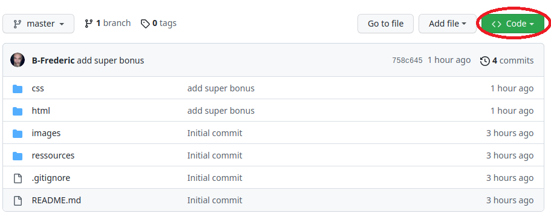

# Récupérer et Renvoyer les répertoires de challenges, parcours, ateliers

## Récupération

1 - Clique sur "Accepter Challenge" dans le lien que l'on t'a envoyer sur Kourou
>

2 - Une fois rediriger sur la page, clique sur **"code"** en haut à droite (bouton vert)

>

3 - Aller dans l'onglet SSH et copie le lien

>

4 - Aller dans le dossier où tu veux créer le clone du répertoire. Exemple du chemin dans terminal :

(chemin principal du dossier "html" que tu dois avoir dans le terminal, avant d'aller dans ton dossier)
>student@teleporter:/var/www/html$ 

>

(chemin donnant a mon dossier dans S01/Challenge, donc mettez votre chemin à vous, exemple S01)
>student@teleporter:/var/www/html/S01$

Je rappel la commande pour se déplacer: 
> cd NomDuFichier

5 - Pour cloner le dossier entre la commande et remplace "collerLienSSH" par le lien
>git clone collerLienSSH

>

## Ouvrir ce dossier dans VSC (toujours dans la lancée)

6 - Déplace toi sur le dossier avec le terminal 
> cd nomDuFichier

>

Exemple du terminal que tu devras avoir: 
> student@teleporter:/var/www/html/S01/Challenge/S01E03-challenge-hero-corp-ton-nom-github

7 - Pour ouvrir dans VSC il te suffit d'entrer la commande
> code .

>

8 - Fait l'exercice (à fond, car tu es trop balèze)

## Envoyer le travail fait

9 - Ouvre le terminal du VSC et entre la commande **(en respectant les espaces)**
> git add .

>

10 - Ensuite entre **(toujours en respectant les espaces)**

>  git commit -m "Commentaire du commit"

>

Exemple pour Commentaire du commit: "add html and css", "fix: bug html" etc...

11 - Dernière étape envoyer le travail
> git push

>

12 - Repos bien mérité

>